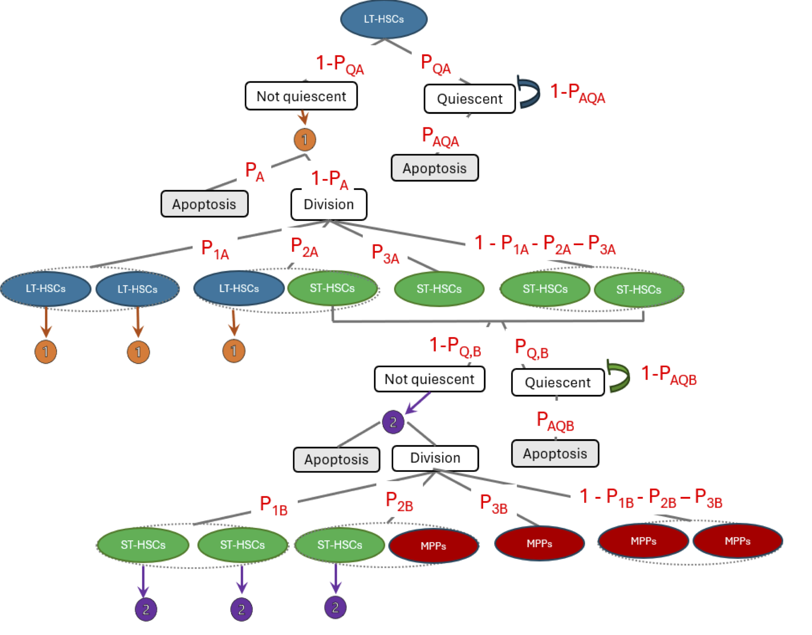

# PAV Hematopoiesis Repository

## Overview
Understanding hematopoietic stem cell (HSC) maintenance and differentiation is challenging due to the complexity of the process and difficulties in observing cellular interactions. This repository provides a quantitative solution: a stochastic dynamical model for long-term hematopoietic stem cells (LT-HSCs) and short-term hematopoietic stem cells (ST-HSCs). The model accounts for cellular stochasticity, predicts homeostasis, and allows for the simulation of different biological conditions.

<div align="center">
    
</div>


## Installation
To set up the project, clone the repository and install the required dependencies:

```bash
git clone <repository-url>
cd PAV-hematopoiesis-repo
pip install -r requirements.txt
```

## Usage
### Running the Model
To run the updated hematopoiesis model, use the following command:

```bash
python src/models/hematopoiesis_model_v3.py
```

## License
This project is licensed under the MIT License. See the LICENSE file for details.

## Acknowledgments
This project was conducted in collaboration with the laboratory of Dr. Katie Kathrein at the Biology Department, University of South Carolina
