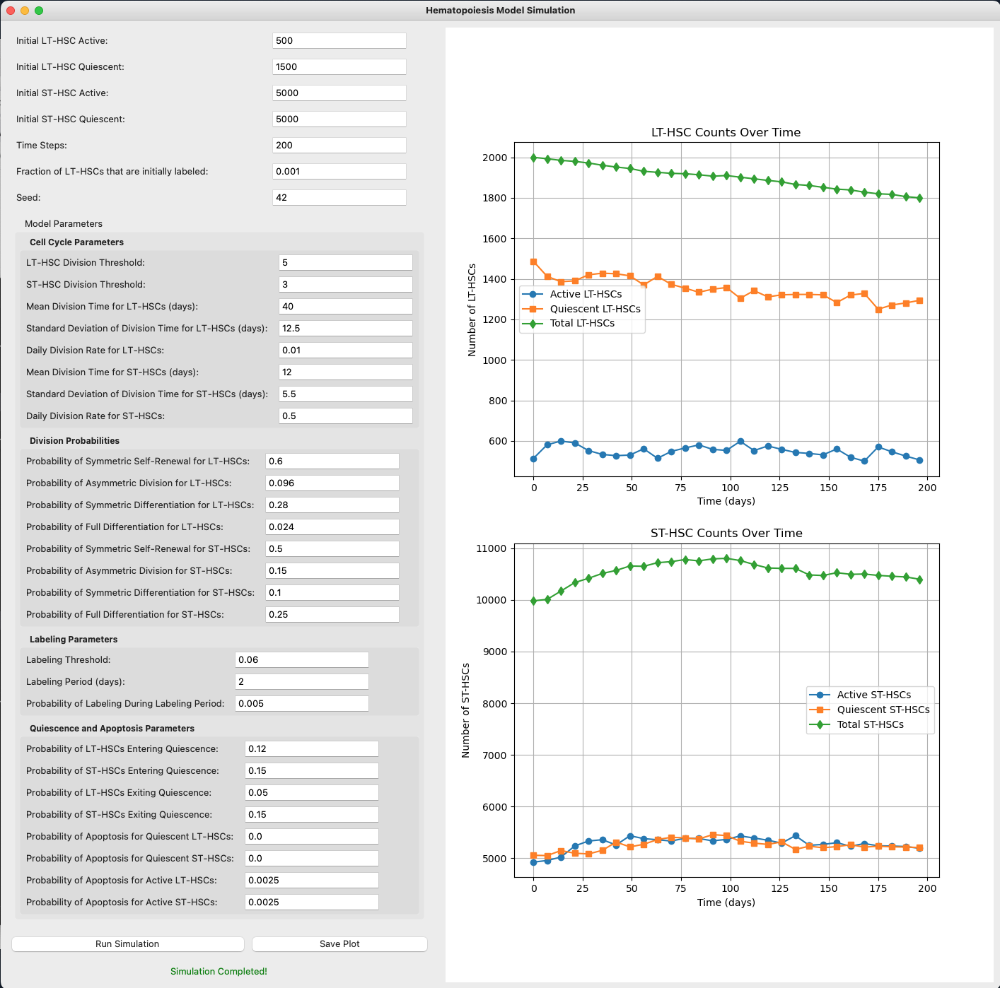

# PAV Hematopoiesis Repository

## Overview
Understanding hematopoietic stem cell (HSC) maintenance and differentiation is challenging due to the complexity of the process and difficulties in observing cellular interactions. This repository provides a quantitative solution: a stochastic dynamical model for long-term hematopoietic stem cells (LT-HSCs) and short-term hematopoietic stem cells (ST-HSCs). The model accounts for cellular stochasticity, predicts homeostasis, and allows for the simulation of different biological conditions.

    

## Model Parameters
Model parameters are summarized in the GUI application.  To run the GUI both the hematopoiesis_gui.py and the hematopoiesis_model_v3.py should be in the same folder.

    

## License
This project is licensed under the MIT License. See the LICENSE file for details.

## Acknowledgments
This project was conducted in collaboration with the laboratory of Dr. Katie Kathrein at the Biology Department, University of South Carolina
