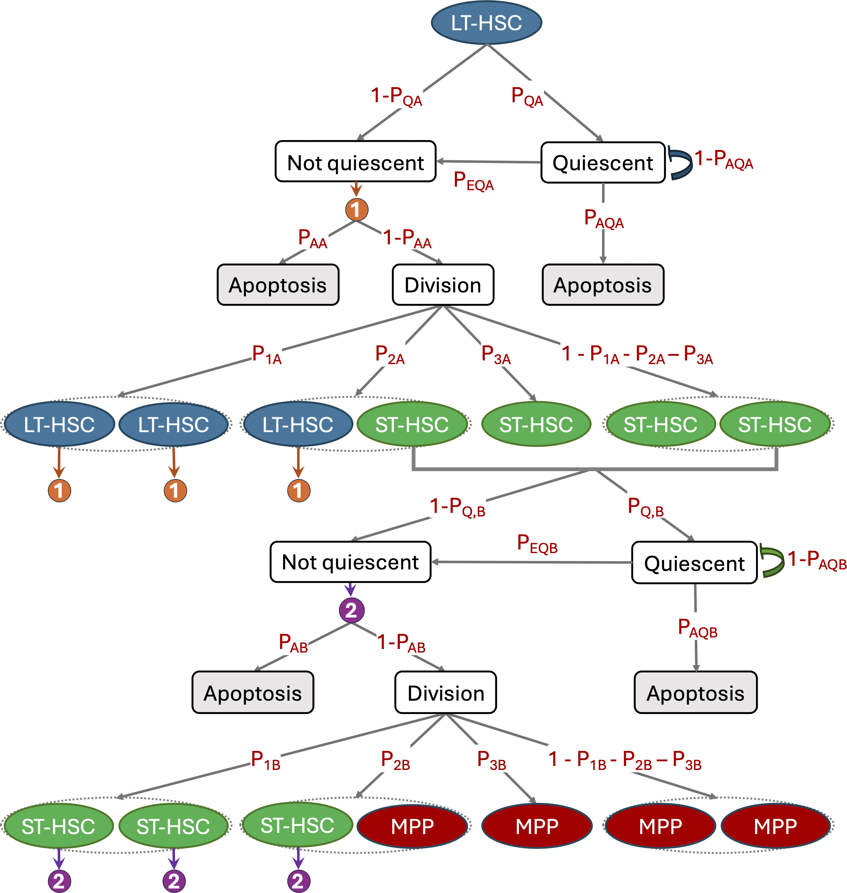

# PAV Hematopoiesis Repository

## Overview
This repository contains a comprehensive project for modeling, analyzing, and visualizing hematopoiesis data. It includes scripts for running simulations, performing sensitivity analysis, and generating visualizations, all structured for easy use and exploration.



## Project Structure
```
PAV-hematopoiesis-repo
├── src
│   ├── analysis
│   │   ├── extinction_analysis.py       # Analyzes extinction events in hematopoiesis
│   │   ├── sobol_sensitivity_analysis.py  # Implements Sobol sensitivity analysis
│   ├── models
│   │   └── hematopoiesis_model_v2.py     # Updated hematopoiesis model code
│   ├── plots
│   │   ├── plot_tree.py                   # Generates tree plots for the model
│   │   └── plotsversustime.py             # Visualizes model outputs over time
├── tests
│   └── test_hematopoiesis.py              # Unit tests for the model and analysis scripts
├── requirements.txt                        # Lists project dependencies
└── README.md                               # Project overview and instructions
```

## Installation
To set up the project, clone the repository and install the required dependencies:

```bash
git clone <repository-url>
cd PAV-hematopoiesis-repo
pip install -r requirements.txt
```

## Usage
### Running the Analysis Scripts
To execute the analysis scripts, navigate to the `src` directory and run the desired script using Python:

```bash
python src/analysis/extinction_analysis.py
python src/analysis/sobol_sensitivity_analysis.py
```

### Running the Model
To run the updated hematopoiesis model, use the following command:

```bash
python src/models/hematopoiesis_model_v2.py
```

### Generating Plots
To create plots, execute the following commands:

```bash
python src/plots/plot_tree.py
python src/plots/plotsversustime.py
```

## Testing
Unit tests are provided to ensure the functionality of the code. To run the tests, use:

```bash
python -m unittest tests/test_hematopoiesis.py
```


## License
This project is licensed under the MIT License. See the LICENSE file for details.

## Acknowledgments
This project was conducted in collaboration with the laboratory of Dr. Katie Kathrein at the Biology Department, University of South Carolina
